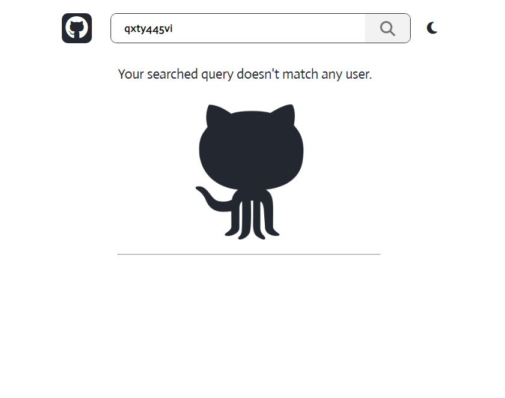

# github-user-search is a project that helps to search **github user's account**.

This project has been made using React with typescript.

## Major features
- Search Github Users
- Debounced Search Functionality
- Github's API integration
- Light/Dark Mode

## Screenshots

> Light Mode

> Dark Mode

> User not found

